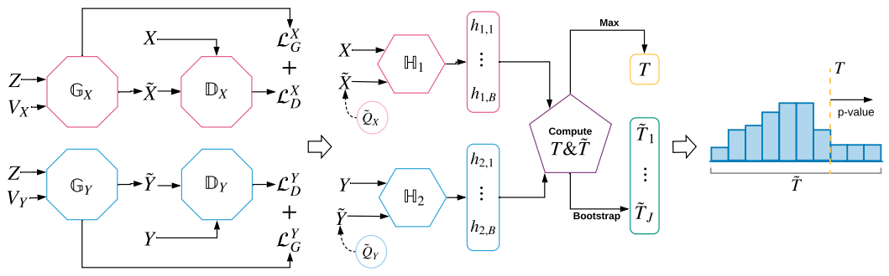
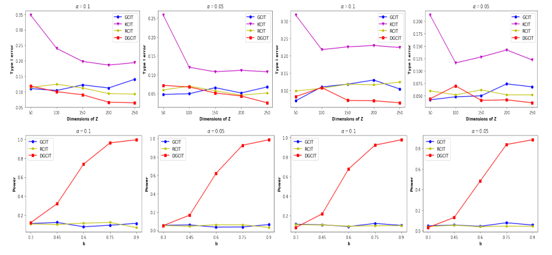
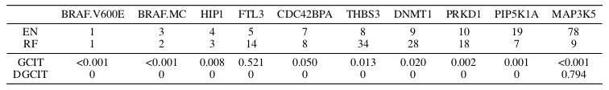

# DGCIT: Double Generative Adversarial Networks for Conditional Independence Testing

This repository contains an implementation and further details of Double Generative Adversarial Networks for Conditional Independence Testing.

Paper link to follow. 

## Illustration of conditional independence testing with double GANs

## Type I error and power

Top panels: the empirical type-I error rate of various tests under H0. From left to right:
normal Z with α = 0.1, normal Z with α = 0.05, Laplacian Z with α = 0.1, and Laplacian Z
with α = 0.05. Bottom panels: the empirical power of various tests under H1.

The results can be reproduced by running `train.py` with the current settings.  

KCIT results were obtained using this implementation: https://github.com/ericstrobl/RCIT/blob/master/R/KCIT.R

## Results for the anti-cancer drug example

The variable importance measures of the elastic net(EN) and random forest(RF) models, versus the
p-values of the GCIT and DGCIT tests for the anti-cancer drug example.

## Dependencies 
python 3.6 and TensorFlow version 2.x
 
## Data
CCLE data used in the paper is downloaded from here: https://github.com/alexisbellot/GCIT/tree/master/CCLE%20Experiments
